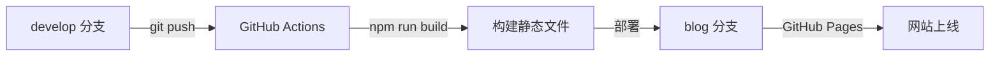

# XSun Personal Website - 项目开发计划

> **项目类型**: 混合型个人网站 (博客 + 简历 + 作品集)  
> **技术栈**: Next.js 14 + React 18 + TypeScript + Tailwind CSS  
> **设计风格**: 极简主义  
> **创建时间**: 2026-02-10  
> **状态**: 📋 规划阶段

---

## 📋 项目概述

### 核心定位
这是一个**极简主义**风格的混合型个人网站，结合了：
- **技术博客**: 分享学习笔记、技术文章
- **个人简历**: 展示技能、经历、联系方式
- **作品集**: 展示个人项目和开源贡献

### 设计理念
- ✨ **极简主义**: 简洁、清晰、专注内容
- ⚡ **高性能**: 快速加载、流畅体验
- 📱 **响应式**: 完美适配各种设备
- ♿ **可访问性**: 良好的无障碍访问

---

## 🎯 功能需求（基于用户确认）

### P0 - 核心必备功能 ✅
- [ ] **文章展示系统** - Markdown 文章列表和详情
- [ ] **搜索功能** - 快速搜索文章内容
- [ ] **标签/分类** - 文章分类管理
- [ ] **暗色主题** - 明/暗主题自动切换

### P1 - 重要功能
- [ ] **个人简介页** - About Me 页面
- [ ] **项目展示** - Portfolio 作品集
- [ ] **响应式导航** - 移动端友好的导航
- [ ] **SEO 优化** - 搜索引擎优化

### P2 - 增值功能（待沟通）
- [ ] **RSS 订阅** - 文章 RSS feed
- [ ] **阅读统计** - 文章阅读时间估算
- [ ] **相关推荐** - 相关文章推荐
- [ ] **评论系统** - 文章评论功能

---

## 🏗️ 技术架构（已确认）

### 技术选型
```
核心: Next.js 14 + React 18 + TypeScript 5
样式: Tailwind CSS 3.x (极简配置)
部署: GitHub Actions → GitHub Pages
```

### 部署流程


---

## 🎨 设计方向（待详细沟通）

### 极简主义设计要素

#### 🎨 配色方案（建议）
**方案 A - 纯黑白**:
- 背景: 纯白 / 纯黑
- 文字: 纯黑 / 纯白
- 强调色: 无或极少

**方案 B - 黑白 + 单一强调色**:
- 背景: 白 / 深灰
- 文字: 黑 / 浅灰
- 强调色: 蓝色 (#0070f3)

**方案 C - 柔和中性色**:
- 背景: 米白 / 深炭灰
- 文字: 深灰 / 浅灰
- 强调色: 橙色或绿色

#### 🖋️ 排版
- **字体**: 系统默认字体（极简）
- **字号**: 16px 基准，清晰易读
- **行距**: 1.6-1.8，舒适阅读
- **留白**: 大量空白，突出内容

#### 🧩 布局
- **首页**: 大标题 + 简短介绍 + 最新文章
- **导航**: 顶部固定或侧边最小化
- **内容区**: 居中，最大宽度 800px
- **卡片**: 简洁边框或无边框阴影

---

## 📄 页面结构（待确认）

### 建议的页面结构

```
网站结构:
├── 首页 (/)
│   ├── 个人简介（一句话）
│   ├── 最新文章（3-5篇）
│   └── 快速导航
│
├── 博客 (/blog)
│   ├── 文章列表
│   ├── 标签筛选
│   └── 搜索功能
│
├── 文章详情 (/blog/[slug])
│   ├── 标题、日期、标签
│   ├── 文章内容
│   └── 相关文章（可选）
│
├── 关于 (/about)
│   ├── 个人介绍
│   ├── 技能列表
│   ├── 工作经历（可选）
│   └── 联系方式
│
└── 项目 (/projects)
    ├── 项目列表
    └── 项目详情
```

---

## 🚀 开发阶段

### Phase 1: 基础架构搭建 (预计 1-2天)
- [ ] Next.js 项目初始化
- [ ] TypeScript 和 Tailwind CSS 配置
- [ ] 基础布局组件 (Header, Footer)
- [ ] 主题切换系统
- [ ] GitHub Actions 部署配置

### Phase 2: 内容系统实现 (预计 2-3天)
- [ ] Markdown 文章解析
- [ ] 博客列表页
- [ ] 博客详情页
- [ ] 搜索功能
- [ ] 标签/分类系统

### Phase 3: 页面完善 (预计 2-3天)
- [ ] 首页设计实现
- [ ] About 页面
- [ ] Projects 页面
- [ ] 响应式优化
- [ ] 性能优化

### Phase 4: 测试上线 (预计 1-2天)
- [ ] 跨浏览器测试
- [ ] 移动端测试
- [ ] SEO 配置
- [ ] 最终部署

---

## ❓ 需要与您沟通确认的事项

### 🎨 设计细节
1. **配色方案**: A
2. **首页布局**: 
   大标题+简介 下拉是新文章导航和标签栏
3. **导航样式**: 
   - 侧边导航？

### 📝 内容需求
1. 个人信息： 略过
2. **技能标签**: 
   以后再开发
3. **项目展示**: 
   省略

### 🔧 功能优先级
1. **历史文章**: 
   从零开始
2. **额外功能**: 
   - 顶部任务栏显示统计信息

### 🚀 时间安排
1. **开发节奏**: 自由
2. **迭代策略**: 
   - 先上线基础版本，再迭代优化

---

## 📊 当前状态

### Git 分支状态
- ✅ **develop 分支**: 已清空，仅包含项目计划
- ✅ **blog 分支**: 已清空，部署占位页面
- 📄 **占位页面**: https://xsun4231.github.io （显示"建设中"）

### 下一步行动
1. ⏳ **等待您的反馈**: 确认设计和内容需求
2. 🚀 **开始 Phase 1**: 搭建基础架构
3. 🎨 **实现设计**: 根据您的偏好定制

---

## 💬 沟通方式

请告诉我：
1. **设计偏好**: 配色、布局、导航样式
2. **个人信息**: 需要展示的内容
3. **功能取舍**: 哪些功能优先实现
4. **时间预期**: 希望什么时候上线

我会根据您的反馈，定制最适合的实现方案！

---

**创建时间**: 2026-02-10  
**最后更新**: 2026-02-10  
**负责人**: Sisyphus AI Agent
