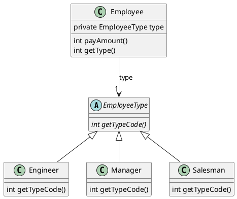

> 原文 [publisher logo Refactoring: Improving the Design of Existing Code](https://books.google.co.jp/books/about/Refactoring.html?id=HmrDHwgkbPsC&printsec=frontcover&source=kp_read_button&redir_esc=y#v=onepage&q&f=false) Chapter 9 Simplifying Conditianal Expressions


## 分离条件 - Decompose Conditional

很多程序之所以“复杂难懂”，是因为出现了“复杂难懂”的条件语句。当人们看到条件语句时，最想获取的信息是：if XXX 的时候，do YYY； else do ZZZ。所以简化条件语句最简单直接的方法就是把长长的判断语句或者大段大段的处理分离出来，留下最基本的`if else`结构，一目了然，至于具体的判断方法和处理内容，则去具体的方法中查看。

> 遇到有嵌套结构的条件语句时，不妨先试试先整理成卫语句(Guard Clauses)，行不通再进行分解处理。

比如我们遇到下面这段代码：
```Java
if (date.before (SUMMER_START) || date.after(SUMMER_END)){
  charge = quantity * winterRate + winterServiceCharge;
}else{
  charge = quantity * summerRate;
}
```

对条件和判断后的代码分别施放**Extract Method**法术:
```Java
if (notSummer(date)){
  charge = winterCharge(quantity);
} else {
  charge = summerCharge (quantity);
}

private boolean notSummer(Date date) {
  return date.before (SUMMER_START) || date.after(SUMMER_END);
}

private double summerCharge(int quantity) {
  return quantity * summerRate;
}

private double winterCharge(int quantity) {
  return quantity * winterRate + winterServiceCharge;
}
```

当然，每次抽离出方法的时候，都不要忘记进行测试，**保证重构不会影响原本的处理结果**，很多时候条件语句并不是十分复杂，看起来好像没有抽离成为方法的必要，这就要看条件语句读起来是否顺畅易懂了，如果可以把原本机器感十足的语句变得更像一段流畅直白的描述，条件语句的重构就是有意义的。

## 整合条件 - Consolidate Conditional Expression
有些条件语句的虽然有着不同的判断条件，却执行着相同的动作。如果可以确定这些判断不需要完全的独立，不妨整合到一起，再抽离出一个方法，这样，条件语句就更有“一个判断”的感觉了。

比如下面的代码：

```Java
double disabilityAmount() {
  if (_seniority < 2) return 0;
  if (_monthsDisabled > 12) return 0;
  if (_isPartTime) return 0;
  // compute the disability amount
```

可以整合成：
```Java
double disabilityAmount() {
  if (isNotEligableForDisability()) return 0;
  // compute the disability amount
```

整合的对象不仅仅是同等级的条件语句(使用ors），有一些嵌套的条件语句更有整合的必要（使用ands）：

```Java
if (onVacation())
    if (lengthOfService() > 10)
        return 1;
return 0.5;
```

如果内层的`if`只是起到筛选的作用，而没有产生分支，就可以将内层条件语句跟外层整合到一起：
```Java
if (onVacation() && lengthOfService() > 10) return 1;
else return 0.5;
```

如果条件语句的处理只是返回不同的值，不妨使用**三元运算符(ternary operator)** 。不过要注意，三元运算符的使用因人而异，有些项目并不喜欢代码里出现三元运算符。
```Java
return (onVacation() && lengthOfService() > 10) ? 1 : 0.5;
```


## 整合重复的条件语句块 Consolidate Duplicate Conditional Fragments
当条件语句的`if`和`else`里出现了相同的处理时，不妨试试将其移动到条件语句之前或者之后，使条件语句中的处理更有“分歧”的感觉。

```Java
if (isSpecialDeal()) {
    total = price * 0.95;
    send();
}
else {
    total = price * 0.98;
    send();
}
```

`send()`出现在具有分歧的处理之后，可以移动到条件语句的后面；如果出现在具有分歧的处理之前，则移动到条件语句的前面。

```Java
if (isSpecialDeal())
    total = price * 0.95;
else
    total = price * 0.98;
send();
```

如果无法确定整合的内容在前还是应该在后，不妨先看一看在条件语句块内，该内容的位置变化是否影响处理结果，
在不影响处理结果的前提下将要整合的内容前移或者后撤之后，再进行重构就可以了。

## 移除控制标记 Remove Control Flag

如果你使用一个变量的值控制真假的判断，不妨考虑在变量值的修改处用`break`或者`return`来替代。

比如下面的代码
```Java
void checkSecurity(String[] people) {
    boolean found = false;
    for (int i = 0; i < people.length; i++) {
        if (! found) {
           if (people[i].equals ("Don")){
             sendAlert();
             found = true;
           }
           if (people[i].equals ("John")){
             sendAlert();
             found = true;
           }
        }
    }
}
```
这段代码使用变量`found`来判断来逃离`for`循环，显然可以使用`break`来代替：
```Java
void checkSecurity(String[] people) {
    for (int i = 0; i < people.length; i++) {
        if (people[i].equals ("Don")){
          sendAlert();
          break;
        }
        if (people[i].equals ("John")){
          sendAlert();
          break;
        }
    }
}
```

这样不仅是代码看起来简洁了许多，也避免了后续得无意义的判断。当然，这里的条件语句还可以整合一下，就不细说了。  

有些时候控制标记不仅仅是用来充当真假的判断条件，也用来保存返回值，这种情况可以考虑在适当的时候使用`return`直接结束方法：

```Java
void checkSecurity(String[] people) {
    String found = "";
    for (int i = 0; i < people.length; i++) {
        if (found.equals("")) {
           if (people[i].equals ("Don")){
              sendAlert();
              found = "Don";
           }
           if (people[i].equals ("John")){
              sendAlert();
              found = "John";
           }
        }
    }
    someLaterCode(found);
}
```

我们可以先把`for`循环的内容抽离出来：  

```Java
void checkSecurity(String[] people) {
    String found = foundMiscreant(people);
    someLaterCode(found);
}
String foundMiscreant(String[] people){
    String found = "";
    for (int i = 0; i < people.length; i++) {
        if (found.equals("")) {
           if (people[i].equals ("Don")){
             sendAlert();
             found = "Don";
           }
           if (people[i].equals ("John")){
             sendAlert();
             found = "John";
           }
        }
    }
    return found;
}
```

可以看到标记`found`成为了返回值，程序的意思很明显是：[如果`found`不是空的，就返回其内容], 所以我们可以直接返回要赋给`found`的值，取消`found`这个变量。 

```Java
String foundMiscreant(String[] people){
    for (int i = 0; i < people.length; i++) {
        if (people[i].equals ("Don")){
           sendAlert();
           return "Don";
        }
        if (people[i].equals ("John")){
           sendAlert();
           return "John";
        }
    }
    return "";
}
```

> 细心观察 return 的位置， 你会有意想不到的收获

## 使用卫语句替代嵌套的条件语句 Replace Nested Conditional with Guard Clauses

条件语句在程序中的使用可以有两种思路：
1. 用来处理明确的分支，程序往哪个方向走都有可能，完全取决于条件的真假。这种情况使用基本的`if else`来处理。
2. 用来处理特殊情况，程序有着一个基本的前进方向，出现一些特殊情况时，需要立即返回特定值或者转为进行特定的处理。这种情况的条件语句，我们可以称之为 卫语句(guard clause)

当我们遇到层层嵌套的`if else`语句时，可以梳理一下程序的语义，如果发现条件语句的作用不是用来产生“平等”的分支，而是一种“出现了这种情况就赶快退出去吧”的感觉的话，不妨将`if else`简化成`guard clause`.

> 这里作者介绍的是 嵌套的条件语句 ，实际上使用卫语句的思路在单一`if-else`时也适用，每当我们写出一个完全体的`if-else`时，都应该思考一下条件语句属于那种类型，很多时候`if-else`的分歧处理都可以用`if`的卫语句解决。

比如下面的这段代码：  

```Java
double getPayAmount() {
  double result;
  if (_isDead) result = deadAmount();
  else {
      if (_isSeparated) result = separatedAmount();
      else {
          if (_isRetired) result = retiredAmount();
          else result = normalPayAmount();
      };
  }
return result;
};
```
这种梯田式的条件语句，而且处理的对象都是返回值，很明显可以使用卫语句来简化，我们从外向里，一层层的将`result`的赋值改为`return`，最后可以得到：

```Java
double getPayAmount() {  
  if (_isDead) return deadAmount();  
  if (_isSeparated) return separatedAmount();  
  if (_isRetired) return retiredAmount();  
  return normalPayAmount();};
```

使用卫语句进行重构并不局限于这一种情况，有时候我们可以发现条件语句筛选了部分情况来进行特定的处理，剩下的情况则返回默认值。这时我们可以考虑反转判断的条件式，来得到一个卫语句，今儿简化代码：

```Java
public double getAdjustedCapital() {  
  double result = 0.0;  
  if (_capital > 0.0) {    
    if (_intRate > 0.0 && _duration > 0.0) {     
      result = (_income / _duration) * ADJ_FACTOR;    
    }  
  }  
  return result;
}
```

书中作者给出了详细的重构过程，这里就不细说了。

```Java
public double getAdjustedCapital() {    
  if (_capital <= 0.0) return 0.0;    
  if (_intRate <= 0.0 || _duration <= 0.0) return 0.0;    
  return (_income / _duration) * ADJ_FACTOR;
}
```

> 工作中很常用到的一个思路就是，如果有一个大大的if框住了几乎整个方法的内容，一定要看看可不可以反转if的条件在最前面直接return，从{}中解放这段代码。


## 利用多态来重构条件语句 Replace Conditional with Polymorphism

比如我们有下面这个结构, `Employee`的`type`为抽象类`EmployeeType`，被三个类实现，每个类返回的`typeCode`不同：



`Employee`的方法`payAmount()`的内容为：
```Java
int payAmount() {
    switch (getType()) {
        case EmployeeType.ENGINEER:
            return _monthlySalary;
        case EmployeeType.SALESMAN:
            return _monthlySalary + _commission;
        case EmployeeType.MANAGER:
            return _monthlySalary + _bonus;
        default:
            throw new RuntimeException("Incorrect Employee");
    }
}
```
因为`type`的其实是`EmployeeType`子类的属性，所以我们可以将这个方法移动到`EmployeeType`中，利用子类来实现不同的处理。首先，移动方法到`EmployeeType`里，由于使用了`Employee`才有的属性，所以我们需要将`employee`作为参数传递进去：

```Java
int payAmount(Employee emp) {
    switch (getTypeCode()) {
        case ENGINEER:
            return emp.getMonthlySalary();
        case SALESMAN:
            return emp.getMonthlySalary() + emp.getCommission();
        case MANAGER:
            return emp.getMonthlySalary() + emp.getBonus();
        default:
            throw new RuntimeException("Incorrect Employee");
    }
}
```
`EmployeeType`是抽象类，所以我们要继续将方法`payAmout()`在具体的子类中进行实现，不过子类中就用不到`switch`了。在重构的过程中，我们可以在`EmployeeType`中添加例外处理，比如当我们在`Engineer`中实现了`payAmount()`后:

```Java
class Engineer ...
  int payAmount(Employee emp) {      
    return emp.getMonthlySalary();  
  }


class EmployeeType...
  int payAmount(Employee emp) {
      switch (getTypeCode()) {
          case ENGINEER:
             throw new RuntimeException ("Should be being overridden");
          case SALESMAN:
             return emp.getMonthlySalary() + emp.getCommission();
          case MANAGER:
             return emp.getMonthlySalary() + emp.getBonus();
          default:
             throw new RuntimeException("Incorrect Employee");
      }
  }
```

如此下去，直到在所有的子类中都实现了`payAmount`之后，将`EmployeeType`的方法改为`abstract`
```Java
class EmployeeType...  
  abstract int payAmount(Employee emp);

class Engineer ...
  int payAmount(Employee emp) {      
    return emp.getMonthlySalary();  
  }

class Salesman...  
  int payAmount(Employee emp) {      
    return emp.getMonthlySalary() + emp.getCommission();  
  } 
class Manager...  
  int payAmount(Employee emp) {      
    return emp.getMonthlySalary() + emp.getBonus();  
  }

```


## 使用空对象 Introduce Null Object

> 空对象模式是一种需要小心使用的设计模式，而且在JavaSE8中引入`Optional<>`后，几乎用不到空对象。


## 插入断言 Introduce Assertion

> 善用 `Assert.isTrue()`， 确保一些必须成立的前提条件，从而让后面的条件判断达到最简化。